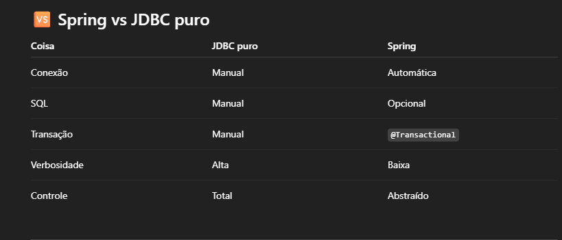
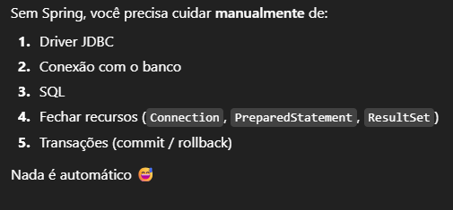

# Banco de dados H2

- nessa branch o objetivo é criar uma versão do nosso projeto que utilize o bando de dados H2 no lugar do banco de dados
  MySQL. O porquê disso? eu quero testar a relação desse banco com o framework Spring Boot. e ver o tipo de
  implementação dele em tal. O H2 substitui o mySql sem precisar instalar nada

## dependências

- Do mesmo jeito que precisamos colocar a dependência do mysql e springs. Precisamos mexer nas dependencias pra receber
  o H2.
- removemos a dependência do mysql e adicionamos a do H2.

## aplicattions.properties

- precisamos mudar o driver para o H2. Pra adicionar a Url do banco de dados.

## rodando o projeto

- Depois de fazer as mudanças necessarias em aplicattions.properties (recomendada a leitura do arquivo), o projeto rodou
  tranquilamente sem edição de outros arquivos

## OBS:

- Do mesmo jeito que o mysql, O spring faz toda a parte de mapeamento e conxão com o banco de dados.
  Ou seja sem o Spring iriamos fazer do jeito "puro", usar o JDBC na raiz.

---

---

Lembrando que depois que vc entende o JDBC, entender o Spring fica 10x mais fácil, vc entende oque ele faz por debaixo
dos panos.
a configuração das propertties ta ativando o console do H2 via browser. se vc quiser mexerno console via intelijjei, comentar aquela linha 