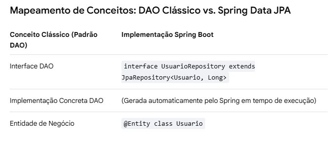

# Arquitetura DAO patterns

Nesse mini trabalho estou usando a arquitetura DAO patterns, que separa as funcionalidades em : acessa o BD e não acessa o BD.

Ela é composta por teres elementos : DAO, Entity e Repository.

## Camada de serviços:
- A camada de serviços / regras de negócio, chama um metodo na interface DAO.
Por padrão não tem nenhum metodo de interação com o banco de dados (CRUD) nessa camada.
EX: ``usuerDao.lerPorId(1)``.  Estou chamando um metodo dentro de userDao que vai ler por um ‘id’, provavelmente deve-me retornar um ‘user’.

- Ou seja : ``userService -> userDao -> BD`` 

## Camada de acesso a dados(DAO):
- A implementação 'concreta' da DAO executa a operação necessaria no banco de dados. no caso
- ``SELECT * FROM users WHERE id = 1``
- A Dao por sua vez retorna os dados, geralmente empacotados como um 'objeto de negocio', ela retorna como se fosse um objeto mesmo

# Como que fica se eu quiser misturar a DAOS pattern com o MVC pattern?
  
## Mescla
- Por mais que pareça inédito e não de fácil visualização as duas encaixam-se perfeitamente.
- A camada de Service e de Daos se encaixa perfeitamente dentro das models do MVC, ate pq no MVC o 'M'(de models), fica onde tudo que diz respeito aquele objeto, 
as suas regras de negócio e a sua conectividade com o BD. Portanto, tudo o que iremos adicionar é uma camada a mais, dentro de models iremos dividir as regras de negócio em classes separadas.
As Daos e as Services.

- Se for o caso de uma MSVC (como o trabalho do lucas), nao tem problema. so iremos tirar a service de models e colocar ela no mesmo nivel de controllers, views e models.
- ``Controllers ->Service -> Models -> Dao -> BD`` 

# E com o Spring? Como que fica?

## Mapemanto JPA/Spring VS Conceittos Dao Patterns

- a DAO acaba virando o repository, pq o Spring ja faz tudo pra gente.

